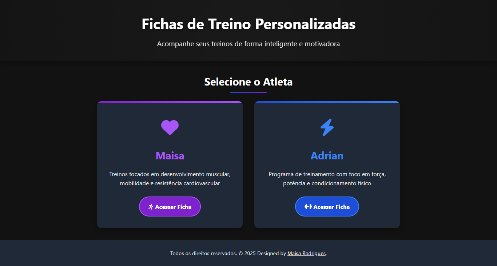
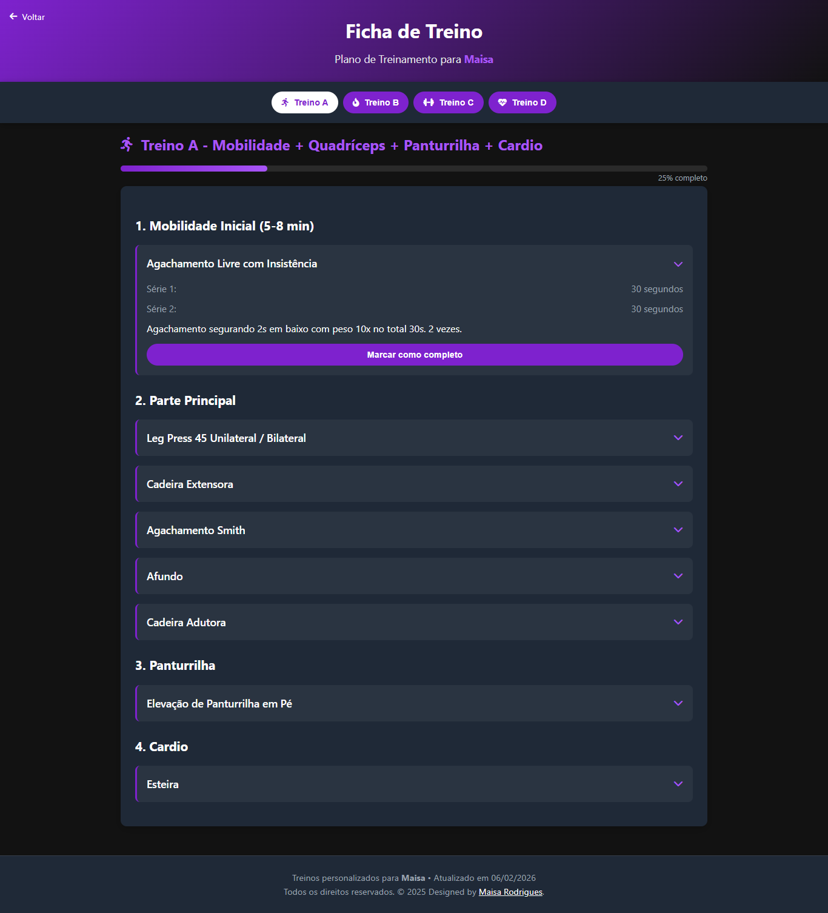

# My Workouts - Gestão de Treinos 🏋️‍♀️📊

  
  

Este projeto é uma aplicação web desenvolvida para organizar e facilitar o acompanhamento de rotinas de treinamento físico. O foco foi criar uma interface limpa e de carregamento rápido, permitindo que o usuário consulte sua ficha de exercícios de forma ágil diretamente do smartphone durante o treino.

## 🎯 Objetivo do Projeto
Diferente de uma landing page convencional, este projeto foca na **experiência de uso repetitivo**. O desafio foi criar um layout que fosse legível sob luz intensa (ambiente de academia) e com botões de fácil interação, priorizando a funcionalidade e a rapidez no acesso às informações.

## 🚀 Tecnologias e Implementações
- **Frontend:** HTML5, CSS3 e JavaScript.
- **Mobile-First Design:** Estrutura pensada prioritariamente para uso em dispositivos móveis.
- **Lógica de Interface:** Organização dos treinos por categorias/dias e listagem clara de séries e repetições.
- **Performance:** Carregamento otimizado para funcionar bem mesmo com conexões de internet instáveis.

## 📂 Funcionalidades
- **Visualização de Fichas:** Exibição organizada de exercícios por grupo muscular ou dia da semana.
- **Acompanhamento de Metas:** Espaço para definição de séries, repetições e carga.
- **Interface Dark/Clean:** Design focado em reduzir distrações e facilitar a leitura.
- **Navegação Ágil:** Menu intuitivo para troca rápida entre diferentes fichas de treino.

## 🌐 Link da Aplicação
Acesse seus treinos aqui: [amaple28.github.io/treinos](https://amaple28.github.io/treinos/)

---
Desenvolvido por **Maisa Rodrigues**
